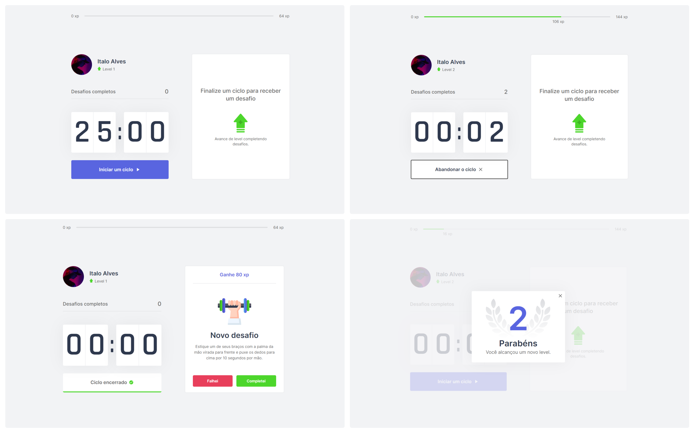

<h1 align="center">
  
  <br />
  <a href="https://www.linkedin.com/in/italo-alves-48b9b897">
    
  </a>
  <a href="https://github.com/Italo-Alves/moveit-nlw4/blob/master/LICENSE.md">
    
  </a>
</h1>

<p align="center">
  <a href="#-descrição">Descrição</a>&nbsp;&nbsp;&nbsp;|&nbsp;&nbsp;&nbsp;
  <a href="#-layout">Layout</a>&nbsp;&nbsp;&nbsp;|&nbsp;&nbsp;&nbsp;
  <a href="#-tecnologias">Tecnologias</a>&nbsp;&nbsp;&nbsp;|&nbsp;&nbsp;&nbsp;
  <a href="#-funcionalidades">Funcionalidades</a>&nbsp;&nbsp;&nbsp;|&nbsp;&nbsp;&nbsp;
  <a href="#octocat-instalação">Instalação</a>&nbsp;&nbsp;&nbsp;|&nbsp;&nbsp;&nbsp;
  <a href="#memo-licença">Licença</a>
</p>

<br />

<p align="center">
  
</p>

## 📄 Descrição

O Move.it é um app que usa a técnica de Pomodoro, esse app faz com que pessoas que passa muito tempo na frente do computador realizar exercícios físicos.

## 🎨 Layout

Você pode acessar o Layout pelo <a href="https://www.figma.com">Figma</a> atravês <a href="https://www.figma.com/file/ge20pu3ofMOKoliUyKx1Nl/Move.it-1.0">desse link</a>.

## 🚀 Tecnologias

Esse projeto foi desenvolvido com as seguintes tecnologias:

- [React](https://pt-br.reactjs.org/)
- [Next.js](https://nextjs.org/)
- [Typescript](https://www.typescriptlang.org/)
- [StyledComponents](https://styled-components.com/)

## 📋 Funcionalidades

- [x] Iniciar um ciclo de 25 minutos.
- [x] Abadornar ciclo.
- [x] Dispara um efeito sonoro quando o ciclo chega ao fim.
- [x] Manda uma notificação quando o ciclo chega ao seu fim.
- [x] A cada ciclo libera um novo desafio.
- [x] Usuário ganha XP a cada desafio concluído.
- [x] Usuário pode subir de nível.

## :octocat: Instalação

### Pré-requisitos

Antes de começar, você vai precisar ter instalado em sua máquina as seguintes ferramentas:
[Git](https://git-scm.com), [Node.js](https://nodejs.org/en/), Além disto é bom ter um editor para trabalhar com o código como [VSCode](https://code.visualstudio.com/)

```bash
# Clone este repositório.
$ git clone https://github.com/Italo-Alves/moveit-nlw4.git

#Vá para a pasta
$ cd moveit-nlw4

# Instale as dependências com Yarn
$ yarn | yarn install

# Instale as dependências com npm
$ npm install | npm i

# Execute aplicação
$ yarn dev | npm run dev

# O app vai está rodando na porta 3000 - acesse <http://localhost:3000>
```

## 📝 Licença

Esse projeto está sob a licença MIT. Veja o arquivo [LICENSE](LICENSE.md) para mais detalhes.

---

Feito com ♥ by Italo Alves :wave:
